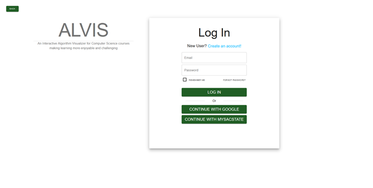

# Alvis Showcase Website
Senior Project for CSC 190 and CSC 191:

Alvis is a web-based algorithm visualizer based on the computer science coursework at CSU Sacramento. Developed by a team 
of eight dubbed BuzzDev, Alvis features an interactive design utilizing React.js, Node.js, and various other technologies. 
Special thanks to our client Dr. Yuan Cheng, and advisors Dr. Haiquan Chen and Dr. Jingwei Yang.

Development team members: Alejandro Blanco, Ryan Blocker, Spencer Broden, Kimlee Chea, Evan Elias, David Garcia, Khanh Luu,
Minh Nguyen

Link:
<https://buzzdevalvis.github.io/>

